[TOC]

# 考题汇总1

### ==交叉熵相关题目==

#### 1、什么是交叉熵

问题来源：<https://www.nowcoder.com/discuss/205843>

回答来源：https://www.nowcoder.com/questionTerminal/299417465fc8448f979f0d38a9b692f2

交叉熵（Cross Entropy）是信息论中一个重要概念，主要用于度量两个概率分布间的差异性信息 

**交叉熵就是用来判定实际的输出与期望的输出的接近程度，交叉熵越小说明两者之间越接近。**  

 交叉熵常用于分类任务，交叉熵损失函数可以用于二分类和多分类。

#### 2、为啥交叉熵可以用做计算代价

回答来源：<https://www.zhihu.com/question/65288314>

相对熵又称KL散度，用于衡量对于同一个随机变量x的两个分布p(x)和q(x)之间的差异。在机器学习中，p(x)常用于描述样本的真实分布，例如[1,0,0,0]表示样本属于第一类，而q(x)则常常用于表示预测的分布，例如[0.7,0.1,0.1,0.1]。显然使用q(x)来描述样本不如p(x)准确，q(x)需要不断地学习来拟合准确的分布p(x)。

**KL散度的值越小表示两个分布越接近**

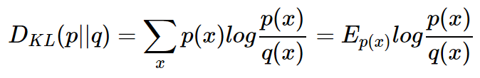

**机器学习中，我们常常使用KL散度来评估predict和label之间的差别，但是由于KL散度的前半部分是一个常量，所以我们常常将后半部分的交叉熵作为损失函数，其实二者是一样的。**

**结论：**为了让学到的模型分布更贴近真实数据分布,我们最小化模型数据分布与训练数据之间的KL散度,而因为训练数据的分布是固定的,因此最小化KL散度等价于最小化交叉熵，因为等价,而且交叉熵更简单更好计算,当然用它。

#### 3、知道交叉熵吧，==推一下多分类的交叉熵怎么来的==；那你知道熵吗，熵的表达式为什么有个log，为什么要取log呢

问题来源：https://www.nowcoder.com/discuss/207287

**1）推一下多分类交叉熵**：？？？


**2）熵：**<https://www.zhihu.com/question/65288314/answer/244557337> 

​       放在信息论的语境里面来说，就是一个事件所包含的信息量。

![[公式]](https://www.zhihu.com/equation?tex=S%28x%29+%3D+-%5Csum_%7Bi%7DP%28x_%7Bi%7D%29log_%7Bb%7DP%28x_%7Bi%7D%29)

**3）为啥会有log**：<https://www.zhihu.com/question/30828247>  

越小概率的事情发生了产生的信息量越大

**如果我们有俩个不相关的事件x和y，那么我们观察到的俩个事件同时发生时获得的信息应该等于观察到的事件各自发生时获得的信息之和，即：**

h(x,y) = h(x) + h(y)

由于x，y是俩个不相关的事件，那么满足p(x,y) = p(x)*p(y).

根据上面推导，我们很容易看出h(x)一定与p(x)的对数有关（因为只有对数形式的真数相乘之后，能够对应对数的相加形式，可以试试）。因此我们有信息量公式如下：

![[公式]](https://www.zhihu.com/equation?tex=h%28x%29%3D-log_%7B2%7Dp%28x%29+)

**信息量度量的是一个具体事件发生了所带来的信息，而熵则是在结果出来之前对可能产生的信息量的期望——考虑该随机变量的所有可能取值，即所有可能发生事件所带来的信息量的期望。即**

![[公式]](https://www.zhihu.com/equation?tex=H%28x%29%3D-sum+%28p%28x%29log_%7B2%7Dp%28x%29+%29)


#### 4、LR损失函数叫最大似然损失函数（交叉熵）

题目来源：<https://www.nowcoder.com/discuss/205258>

逻辑回归损失函数：


#### 5、为何使用交叉熵作为损失函数，与MSE等相比其优点在哪里？

问题来源：<https://www.nowcoder.com/discuss/204240>  注意回答与MSE相比的优点

####  6、已知softmax输出概率序列与实际分布概率序列，计算两者交叉熵**（交叉熵）**

问题来源：<https://www.nowcoder.com/discuss/202732>

找个题目自己练一下就可

放公式就可，可以看我的代码softmax_cross.py   

简而言之就是  loss=mean(-ln(pred))  pred是该样本以及该类别的概率

#### 7、问了二分类交叉熵，和多分类交叉熵 的区别 和一些相关的问题

问题来源：<https://www.nowcoder.com/discuss/198699>

答案：<https://www.cnblogs.com/wanghui-garcia/p/10862733.html>

放公式就可，可以看我的代码softmax_cross.py  


#### 8、softmax、交叉熵计算过程，反向传播过程；

问题来源：<https://www.nowcoder.com/discuss/192224>

答案：多分类softmax求导过程：<https://zhuanlan.zhihu.com/p/25723112>

​           二分类交叉熵：<https://blog.csdn.net/u014313009/article/details/51043064>          


#### 9、求一下交叉熵的导数；反向传播梯度推导（relu、sigmoid、交叉熵公式）

问题来源：<https://www.nowcoder.com/discuss/184384>；<https://www.nowcoder.com/discuss/155356>


### ==正则化==

#### 1、正则化为什么能降低过拟合程度，并且说明下下L1正则化和L2正则化

问题来源：<https://zhuanlan.zhihu.com/p/35356992>

降低过拟合程度：

正则化之所以能够降低过拟合的原因在于，正则化是结构风险最小化的一种策略实现。

给loss function加上正则化项，能使得新得到的优化目标函数h = f+normal，需要在f和normal中做一个权衡（trade-off），如果还像原来只优化f的情况下，那可能得到一组解比较复杂，使得正则项normal比较大，那么h就不是最优的，因此可以看出加正则项能让解更加简单，符合奥卡姆剃刀理论，同时也比较符合在偏差和方差（方差表示模型的复杂度）分析中，通过降低模型复杂度，得到更小的泛化误差，降低过拟合程度。

L1正则化和L2正则化：

L1正则化就是在loss function后边所加正则项为L1范数，**加上L1范数容易得到稀疏解**（0比较多）。L2正则化就是loss function后边所加正则项为L2范数的平方，**加上L2正则相比于L1正则来说，得到的解比较平滑（不是稀疏），但是同样能够保证解中接近于0（但不是等于0，所以相对平滑）的维度比较多，降低模型的复杂度**。

#### 2、为什么L1正则化可以保持参数的稀疏性

问题来源：<https://www.nowcoder.com/discuss/210333>

回答：<https://blog.csdn.net/houhuipeng/article/details/94361326>

​       因此，一句话总结就是：L1会趋向于产生少量的特征，而其他的特征都是0，而L2会选择更多的特征，这些特征都会接近于0。Lasso在特征选择时候非常有用，而Ridge就只是一种规则化而已。

####  3、L1 L2正则化的先验分布

问题来源：<https://www.nowcoder.com/discuss/198053>

**L1正则先验分布是Laplace分布，L2正则先验分布是Gaussian分布**


#### 4、机器学习中正则化项L1和L2的直观理解

问题来源：<https://www.nowcoder.com/discuss/205258>

回答：<https://blog.csdn.net/jinping_shi/article/details/52433975>；

<https://www.jianshu.com/p/4bad38fe07e6>

#### 5、==正则化与奥卡姆剃刀==


### ==ResNet、GoogleNet等==

#### 1、ResNet具体怎么实现的

问题来源：<https://www.nowcoder.com/discuss/201129>


#### 2、ResNet描述、介绍特点、介绍为什么效果不会随着深度变差、与V2的区别

问题来源：<https://www.nowcoder.com/discuss/206089>

大意是神经网络越来越深的时候，反传回来的梯度之间的相关性会越来越差，最后接近白噪声。因为我们知道图像是具备局部相关性的，那其实可以认为梯度也应该具备类似的相关性，这样更新的梯度才有意义，如果梯度接近白噪声，那梯度更新可能根本就是在做随机扰动。

有了梯度相关性这个指标之后，作者分析了一系列的结构和激活函数，发现resnet在保持梯度相关性方面很优秀（相关性衰减从 ![[公式]](https://www.zhihu.com/equation?tex=%5Cfrac%7B1%7D%7B2%5EL%7D) 到了 ![[公式]](https://www.zhihu.com/equation?tex=%5Cfrac%7B1%7D%7B%5Csqrt%7BL%7D%7D) ）。这一点其实也很好理解，从梯度流来看，有一路梯度是保持原样不动地往回传，这部分的相关性是非常强的。


### Loss

#### 1、loss function有哪些，对应什么task

问题来源：<https://www.nowcoder.com/discuss/206089>

回答：<https://zhuanlan.zhihu.com/p/47202768>

1）**Hinge Loss**

Hinge损失可以用来解决间隔最大化问题，如在SVM中解决几何间隔最大化问题


里面有numpy实现<https://zhuanlan.zhihu.com/p/44407513>

2）**交叉熵损失函数**

3）Contrastive Loss

4）Triplet Loss


5）Center Loss

中心损失函数center loss，来自论文`A Discriminative Feature Learning Approach for Deep Face Recognition`，其目的是关注类内分布均匀性的，想让其绕类内中心均匀分布，最小化类内差异，公式如下：


5）MSE Loss

6）L-Softmax

最大间隔softmax loss，出发点也是类内压缩和类间分离


7）Lovasz-Softmax loss

1）Jaccard loss满足子模函数的性质，但它目前只适用于离散情况的计算，如果网络预测结果是连续的则经过离散化会导致不可导。因此Jaccard loss无法直接接在网络后面；
2）因为是子模函数，所以可以对其进行Lovasz extension，使其可导且输入空间从离散变成连续的，其输出值与原函数在上的输出值保持相等，并具有凸性，优化方向保持一致。

8、contrastive loss


#### 2、 如何修改 Softmax loss 达到缓解 过拟合

问题：<https://www.nowcoder.com/discuss/200674>


#### 3、L1_loss和L2_loss的区别

问题：<https://www.nowcoder.com/discuss/195114>


#### 4、yolo与fastercnn的loss，focal loss


### ==优化函数、梯度下降、反向传播==

#### 1、*梯度下降原理，反向传播原理；为什么可以用梯度下降？梯度下降法使用了什么重要的数学依据？梯度下降的伪代码？*

我赶脚这个博客写的不错<https://www.jianshu.com/p/c7e642877b0e>


为什么可以用梯度下降？

**神经网络中的学习过程可以形式化为最小化损失函数问题。**


数学依据：

极小值导数为0


#### 2、梯度下降法，牛顿法和拟牛顿法的区别；神经网络为啥不用拟牛顿法而是用梯度下降

<https://www.nowcoder.com/discuss/215907>

回答：<https://zhuanlan.zhihu.com/p/25703402>

梯度下降法：梯度下降法的优化思想是用当前位置负梯度方向作为搜索方向，因为该方向为当前位置的最快下降方向，所以也被称为是“最速下降法”。最速下降法越接近目标值，步长越小，前进越慢。

**牛顿法：牛顿法是采用其损失函数的二阶偏导数寻找更好的训练下降方向，所以它相比梯度下降只要更少的迭代次数就能下降到损失函数的极小值，因此函数收敛速度也会大幅度地加快。**

**拟牛顿法适用于绝大多数案例中：它比梯度下降和共轭梯度法收敛更快，并且也不需要确切地计算海塞矩阵及其逆矩阵。**

梯度下降法和牛顿法/拟牛顿法相比，两者都是迭代求解，不过梯度下降法是梯度求解，而牛顿法/拟牛顿法是用二阶的海森矩阵的逆矩阵或伪逆矩阵求解。相对而言，使用牛顿法/拟牛顿法收敛更快。但是每次迭代的时间比梯度下降法长。

#### 3、梯度下降过程中如果不按正确的方向进行怎么办

<https://www.nowcoder.com/discuss/215907>

**1. 动量**

SGD方法中的高方差振荡使得网络很难稳定收敛，所以有研究者提出了一种称为动量（Momentum）的技术，通过优化相关方向的训练和弱化无关方向的振荡，来加速SGD训练。

这里的动量与经典物理学中的动量是一致的，就像从山上投出一个球，在下落过程中收集动量，小球的速度不断增加。

在参数更新过程中，其原理类似：

1) 使网络能更优和更稳定的收敛；

2) 减少振荡过程。

当其梯度指向实际移动方向时，动量项γ增大；当梯度与实际移动方向相反时，γ减小。这种方式意味着动量项只对相关样本进行参数更新，减少了不必要的参数更新，从而得到更快且稳定的收敛，也减少了振荡过程。


#### 5、随机梯度下降算法和直接梯度下降算法的区别？；随机梯度下降，标准梯度

<https://www.nowcoder.com/discuss/33737>

**批量梯度下降法**，是梯度下降法最常用的形式，具体做法也就是在更新参数时**使用所有的样本来进行更新**。

**随机梯度下降法**，其实和批量梯度下降法原理类似，区别在与求梯度时没有用所有的m个样本的数据，而是仅仅选**取一个样本j来求梯度**。

**小批量梯度下降法**是批量梯度下降法和随机梯度下降法的折衷，也就是对于m个样本，我们**采用x个样子**来迭代。

**SGD最大的缺点是下降速度慢，而且可能会在沟壑的两边持续震荡，停留在一个局部最优点。**

#### 6、主要问最优化方面的知识，梯度下降法的原理以及各个变种（批量梯度下降，随机梯度下降法，mini 梯度下降法），以及这几个方法会不会有局部最优问题，牛顿法原理和适用场景，有什么缺点，如何改进（拟牛顿法）

<https://www.nowcoder.com/discuss/33737>

方法介绍如上

优缺点：

1、梯度下降：会有局部最优

传统的批量梯度下降将计算整个数据集梯度，但只会进行一次更新，因此在处理大型数据集时速度很慢且难以控制，甚至导致内存溢出。

权重更新的快慢是由学习率η决定的，并且可以在凸面误差曲面中收敛到全局最优值，在非凸曲面中可能趋于局部最优值。

使用标准形式的批量梯度下降还有一个问题，就是在训练大型数据集时存在冗余的权重更新。

2	、**随机梯度下降法**：会有局部最优

优点：对于训练速度来说，随机梯度下降法由于每次仅仅采用一个样本来迭代，训练速度很快，而批量梯度下降法在样本量很大的时候，训练速度不能让人满意。

缺点：对于准确度来说，随机梯度下降法用于仅仅用一个样本决定梯度方向，**导致解很有可能不是最优**。对于收敛速度来说，由于随机梯度下降法一次迭代一个样本，导致迭代方向变化很大，**不能很快的收敛到局部最优解**。

3、**mini 梯度下降法**：局部最优

1) 可以减少参数更新的波动，最终得到效果更好和更稳定的收敛。

2) 还可以使用最新的深层学习库中通用的矩阵优化方法，使计算小批量数据的梯度更加高效。

3) 通常来说，小批量样本的大小范围是从50到256，可以根据实际问题而有所不同。

4) 在训练神经网络时，通常都会选择小批量梯度下降算法。


#### 9、梯度下降法有哪些，节点相似性计算有哪些，最小二乘法，逻辑回归推导

问题：<https://www.nowcoder.com/discuss/190833>

#### 10、逻辑斯蒂回归的假设、目标函数和优化方法，除了用梯度下降还能用什么

来源：<https://www.nowcoder.com/discuss/106197>

#### 11、极大似然估计和梯度下降区别

来源：<https://www.nowcoder.com/discuss/185161>

#### 12、你说优化梯度下降函数，请说出常见的梯度下降函数以及他们的优缺点，最好写出公式

来源：<https://www.nowcoder.com/discuss/204240>

**回答：**<https://zhuanlan.zhihu.com/p/32230623>

1、直接使用梯度下降：

传统的批量梯度下降将计算整个数据集梯度，但只会进行一次更新，因此在处理大型数据集时速度很慢且难以控制，甚至导致内存溢出。

权重更新的快慢是由学习率η决定的，并且可以在凸面误差曲面中收敛到全局最优值，在非凸曲面中可能趋于局部最优值。（注意，国际上凹凸函数与同济大学的凹凸相反）

使用标准形式的批量梯度下降还有一个问题，就是在训练大型数据集时存在冗余的权重更新。

2	、**随机梯度下降法**：会有局部最优

优点：对于训练速度来说，随机梯度下降法由于每次仅仅采用一个样本来迭代，训练速度很快，而批量梯度下降法在样本量很大的时候，训练速度不能让人满意。

缺点：对于准确度来说，随机梯度下降法用于仅仅用一个样本决定梯度方向，**导致解很有可能不是最优**。对于收敛速度来说，由于随机梯度下降法一次迭代一个样本，导致迭代方向变化很大，**不能很快的收敛到局部最优解**。

3、**mini 梯度下降法**：局部最优

1) 可以减少参数更新的波动，最终得到效果更好和更稳定的收敛。

2) 还可以使用最新的深层学习库中通用的矩阵优化方法，使计算小批量数据的梯度更加高效。

3) 通常来说，小批量样本的大小范围是从50到256，可以根据实际问题而有所不同。

4) 在训练神经网络时，通常都会选择小批量梯度下降算法。

4、**SGD with Momentum**

为了抑制SGD的震荡，SGDM认为梯度下降过程可以加入惯性。下坡的时候，如果发现是陡坡，那就利用惯性跑的快一些。SGDM全称是SGD with momentum，在SGD基础上引入了一阶动量：

![[公式]](https://www.zhihu.com/equation?tex=m_t+%3D+%5Cbeta_1+%5Ccdot+m_%7Bt-1%7D+%2B+%281-%5Cbeta_1%29%5Ccdot+g_t)

一阶动量是各个时刻梯度方向的指数移动平均值，约等于最近 ![[公式]](https://www.zhihu.com/equation?tex=1%2F%281-%5Cbeta_1%29) 个时刻的梯度向量和的平均值。

也就是说，t时刻的下降方向，不仅由当前点的梯度方向决定，而且由此前累积的下降方向决定。 ![[公式]](https://www.zhihu.com/equation?tex=%5Cbeta_1) 的经验值为0.9，这就意味着下降方向主要是此前累积的下降方向，并略微偏向当前时刻的下降方向。想象高速公路上汽车转弯，在高速向前的同时略微偏向，急转弯可是要出事的。

5、**SGD with Nesterov Acceleration**

SGD 还有一个问题是困在局部最优的沟壑里面震荡。想象一下你走到一个盆地，四周都是略高的小山，你觉得没有下坡的方向，那就只能待在这里了。可是如果你爬上高地，就会发现外面的世界还很广阔。因此，我们不能停留在当前位置去观察未来的方向，而要向前一步、多看一步、看远一些。

NAG全称Nesterov Accelerated Gradient，是在SGD、SGD-M的基础上的进一步改进，改进点在于步骤1。我们知道在时刻t的主要下降方向是由累积动量决定的，自己的梯度方向说了也不算，那与其看当前梯度方向，不如先看看如果跟着累积动量走了一步，那个时候再怎么走。因此，NAG在步骤1，不计算当前位置的梯度方向，而是计算如果按照累积动量走了一步，那个时候的下降方向：

![[公式]](https://www.zhihu.com/equation?tex=g_t%3D%5Cnabla+f%28w_t-%5Calpha+%5Ccdot+m_%7Bt-1%7D+%2F+%5Csqrt%7BV_%7Bt-1%7D%7D%29)

然后用下一个点的梯度方向，与历史累积动量相结合，计算步骤2中当前时刻的累积动量。  

**6、Adam**

谈到这里，Adam和Nadam的出现就很自然而然了——它们是前述方法的集大成者。我们看到，SGD-M在SGD基础上增加了一阶动量，AdaGrad和AdaDelta在SGD基础上增加了二阶动量。把一阶动量和二阶动量都用起来，就是Adam了——Adaptive + Momentum。

SGD的一阶动量：

![[公式]](https://www.zhihu.com/equation?tex=m_t+%3D+%5Cbeta_1+%5Ccdot+m_%7Bt-1%7D+%2B+%281-%5Cbeta_1%29%5Ccdot+g_t)

加上AdaDelta的二阶动量：

![[公式]](https://www.zhihu.com/equation?tex=V_t+%3D+%5Cbeta_2+%2A+V_%7Bt-1%7D+%2B+%281-%5Cbeta_2%29+g_t%5E2)

优化算法里最常见的两个超参数 ![[公式]](https://www.zhihu.com/equation?tex=+%5Cbeta_1%2C+%5Cbeta_2) 就都在这里了，前者控制一阶动量，后者控制二阶动量。


#### 13、LR除了可以用梯度下降法求还可以用什么求？LR梯度下降法推导，以及伪代码

<https://www.nowcoder.com/discuss/182629>

#### 14、梯度下降陷入局部最优有什么解决办法；

<https://www.nowcoder.com/discuss/200260>

#### 15、梯度消失梯度爆炸是什么？为什么会出现？如何解决？（表现是什么）

<https://www.nowcoder.com/discuss/159587>

**梯度消失：**

定义：在神经网络中，当前面隐藏层的学习速率低于后面隐藏层的学习速率，即随着隐藏层数目的增加，分类准确率反而下降了。这种现象叫做消失的梯度问题。

原因：一般我们初始化权重参数W时，通常都小于1，用的最多的应该是0，1正态分布吧。

所以 ![[公式]](https://www.zhihu.com/equation?tex=%7C%5Csigma%27%5Cleft%28z%5Cright%29w%7C%5Cleq0.25) ，**多个小于1的数连乘之后，那将会越来越小，导致靠近输入层的层的权重的偏导几乎为0，也就是说几乎不更新，这就是梯度消失的根本原因**。


**梯度爆炸：**

定义：梯度爆炸就是由于初始化权值过大，前面层会比后面层变化的更快，就会导致权值越来越大，梯度爆炸的现象就发生了。

原因：在深层网络或循环神经网络中，误差梯度可在更新中累积，变成非常大的梯度，然后导致网络权重的大幅更新，并因此使网络变得不稳定。在极端情况下，权重的值变得非常大，以至于溢出，导致 NaN 值。

网络层之间的梯度（值大于 1.0）重复相乘导致的指数级增长会产生梯度爆炸。

表现：训练过程中出现梯度爆炸会伴随一些细微的信号，如：

​	模型无法从训练数据中获得更新（如低损失）。

​	模型不稳定，导致更新过程中的损失出现显著变化。

​	训练过程中，模型损失变成 NaN。


#### 16、常用的优化函数的介绍？

#### 17、CNN反向传播细节，如卷积、池化、全连接、BN是如何反向的？

<https://www.nowcoder.com/discuss/205260>

回答：<https://www.cnblogs.com/pinard/p/6494810.html>

池化层反向传播：

**池化层一般没有参数**，所以反向传播的时候，**只需对输入参数求导，不需要进行权值更新**。但是具体在计算的时候是要根据Max还是Average来进行区分，进行参数更新的。


**fc层反向传播：**

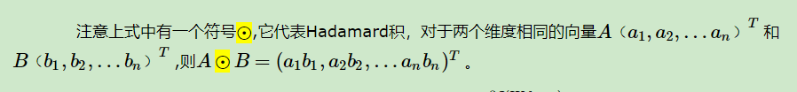

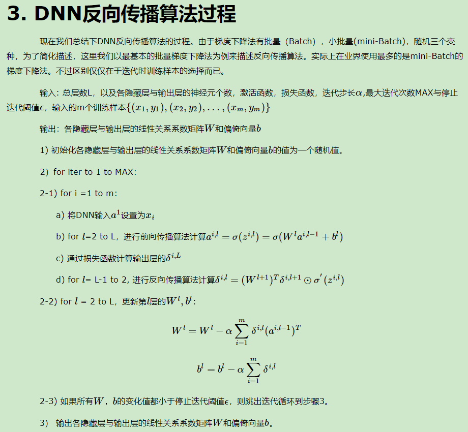

**卷积的传播过程：**

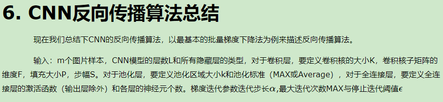

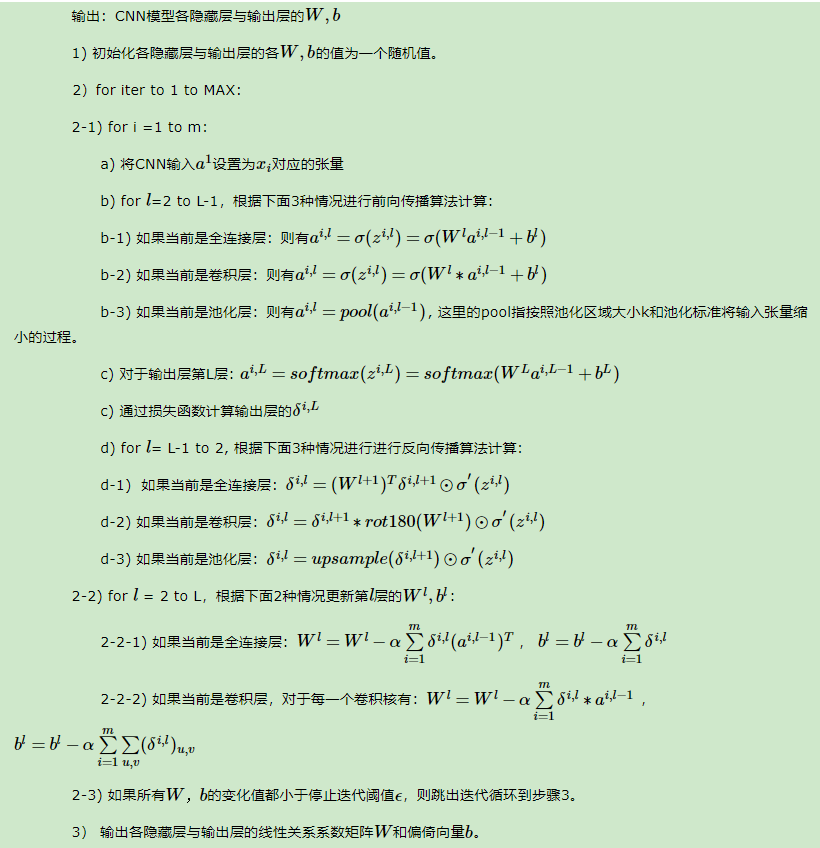

BN层反向传播：

回答：<https://zhuanlan.zhihu.com/p/26138673>


#### 18、简单叙述卷积神经网络前向传播和反向传播过程

<https://www.nowcoder.com/discuss/160433>

#### 19、用numpy或者tensor实现一个正向及反向传播

<https://www.nowcoder.com/discuss/155356>


### ==卷积==

#### 1、卷积层的计算细节

<https://www.nowcoder.com/discuss/216007>

#### 2、空洞卷积解决的问题，反卷积

<https://www.nowcoder.com/discuss/186113>

Up-sampling / pooling layer (e.g. bilinear interpolation) is deterministic. (a.k.a. not learnable)

内部数据结构丢失；空间层级化信息丢失。

小物体信息无法重建 (假设有四个pooling layer 则 任何小于 2^4 = 16 pixel 的物体信息将理论上无法重建。)

空洞卷积计算结果：

![[公式]](https://www.zhihu.com/equation?tex=H_%7Bout%7D%3D%5Cleft%5B+%5Cfrac%7BH_%7Bin%7D%2B2%5Ctimes%7Bpadding%5B0%5D-dilation%5B0%5D%5Ctimes%28%7Bkernelsize%5B0%5D-1%7D%29-1%7D%7D%7Bstride%5B0%5D%7D%5Cright%5D%2B1)

普通卷积输出结果：

![[公式]](https://www.zhihu.com/equation?tex=H_%7Bout%7D%3D%5Cleft%5B+%5Cfrac%7BH_%7Bin%7D%2B2%5Ctimes%7Bpadding%5B0%5D-kernelsize%5B0%5D%7D%7D%7Bstride%5B0%5D%7D%5Cright%5D%2B1)


- **普通卷积的感受野计算**

对于普通卷积，我们将其感受野表示后可以得到一个结论，假设感受野初始大小为1，对于每一层来说，该层的感受野与上一层有一种线性关系！其与每个layer的stride和kernelsize有关，**与padding没有关系，感受野只是表示两者的映射关系，与原始图的大小无关对吧！**

![[公式]](https://www.zhihu.com/equation?tex=F%28i%2Cj-1%29%3D%28F%28i%2Cj%29-1%29%2Astride%2Bkernelsize) 

其中 ![[公式]](https://www.zhihu.com/equation?tex=F%28i%2Cj%29) 表示第i层对第j层的局部感受野，所以这个公式是从上层向下层计算感受野的！	


- **带dilation的感受野计算**

![[公式]](https://www.zhihu.com/equation?tex=F%28i%2Cj-1%29%3D%28F%28i%2Cj%29-1%29%2Astride%2Bdilation%2A%28kernelsize-1%29%2B1)

#### 3、普通卷积、DW+PW卷积计算量推导

<https://www.nowcoder.com/discuss/209857>

#### 4、手推卷积神经网络公式，2D的 3D的，带深度的，很多。可能重点就是看是不是真正了解卷积过程

<https://www.nowcoder.com/discuss/192224>

#### 5、卷积的定义，公式，为什么用卷积，除了图像还能用来做什么

<https://www.nowcoder.com/discuss/99190>

#### 6、深度学习中1*1卷积的作用

<https://www.nowcoder.com/discuss/204638>

#### 7、卷积层和池化层有什么区别

<https://www.nowcoder.com/discuss/165930>

#### 8、计算卷积操作的浮点计算量；卷积参数量计算

<https://www.nowcoder.com/discuss/192689>

#### 9、卷积的物理意义

<https://www.nowcoder.com/discuss/198665>	

#### 10、问池化和卷积是怎么反向传播的，1x1的卷积核有什么用，3x3的卷积核和一个1x3加一个3x1的有什么区别?

<https://www.nowcoder.com/discuss/106621>

#### 11、分组卷积的优点

<https://www.nowcoder.com/discuss/164589>

### ==池化==

#### 1、CNN池化层干嘛的？原理？池化层的作用；池化除了降采样还有啥用？

<https://www.nowcoder.com/discuss/121605>

#### 2、CNN反池化层干嘛的；反池化层的作用

<https://www.nowcoder.com/discuss/152117>

#### 3、2个3x3池化和9x9池化的区别？

<https://www.nowcoder.com/discuss/161384>

#### 4、卷积层和池化层有什么区别

<https://www.nowcoder.com/discuss/92370>

卷积层：用它来进行特征提取。

池化层：对输入的特征图进行压缩，一方面使特征图变小，简化网络计算复杂度；一方面进行特征压缩，提取主要特征

#### 5、有哪些池化方式？

<https://www.nowcoder.com/discuss/93743>

#### 6、如何计算池化层与卷积层的感受野？


### ==全连接层==

#### 1、为什么CNN比全连接效果好？

<https://www.nowcoder.com/discuss/173524>

#### 2、全连接层和卷积层连接方式有什么区别，有什么作用

<https://www.nowcoder.com/discuss/104071>

#### 3、当全连接跟dropout连着用需要注意什么？

<https://www.nowcoder.com/discuss/93743>


### ==BatchNorm==

#### 1、BN原理？BN的实现？BN的作用？BN训练期间和测试期间的区别？BN中的batch怎么选择？

问题来源：<https://www.nowcoder.com/discuss/211174>

优秀博客：<https://www.cnblogs.com/guoyaohua/p/8724433.html>

BN，Batch Normalization，就是在深度神经网络训练过程中使得每一层神经网络的输入保持相近的分布。

![[公式]](https://www.zhihu.com/equation?tex=u_%7Bc%7D%3D%5Cfrac%7B1%7D%7BN+H+W%7D+%5Csum_%7Bn%2C+h%2C+w%7D+X_%7Bn+h+w+c%7D)

![[公式]](https://www.zhihu.com/equation?tex=%5Csigma_%7Bc%7D%5E%7B2%7D%3D%5Cfrac%7B1%7D%7BN+H+W%7D+%5Csum_%7Bn%2C+h%2C+w%7D%5Cleft%28X_%7Bn+h+w+c%7D-u_%7Bc%7D%5Cright%29%5E%7B2%7D)

![[公式]](https://www.zhihu.com/equation?tex=Y_%7Bn+h+w+c%7D%3D%5Cfrac%7BX_%7Bn+h+w+c%7D-u_%7Bc%7D%7D%7B%5Csqrt%7B%5Csigma_%7Bc%7D%5E%7B2%7D%2B%5Cepsilon%7D%7D)

![[公式]](https://www.zhihu.com/equation?tex=A_%7Bn+h+w+c%7D%3D%5Cgamma_%7Bc%7D+Y_%7Bn+h+w+c%7D%2B%5Cbeta_%7Bc%7D)


**为什么要用BN?**

对于神经网络的各层输出，由于它们经过了层内操作作用，其分布显然与各层对应的输入信号分布不同，而且差异会随着网络深度增大而增大。通过mini-batch来规范化某些层/所有层的输入，从而可以固定每层输入信号的均值与方差。然后**把每层神经网络任意神经元这个输入值的分布强行拉回到均值为0方差为1的标准正态分布**。

***加入缩放和平移变量的原因是：保证每一次数据经过归一化后还保留原有学习来的特征，同时又能完成归一化操作，加速训练。*** 


那BN到底是什么原理呢？说到底还是**为了防止“梯度弥散”**。关于梯度弥散，大家都知道一个简单的栗子：![[公式]](https://www.zhihu.com/equation?tex=0.9%5E%7B30%7D%5Capprox+0.04)。在BN中，是通过将activation规范为均值和方差一致的手段使得原本会减小的activation的scale变大。

**BN的作用？**

①不仅仅极大提升了训练速度，收敛过程大大加快；②还能增加分类效果，一种解释是这是类似于Dropout的一种防止过拟合的正则化表达方式，所以不用Dropout也能达到相当的效果；③另外调参过程也简单多了，对于初始化要求没那么高，而且可以使用大的学习率等。

**BN训练和测试时的参数是一样的嘛？**

对于BN，在训练时，是对每一批的训练数据进行归一化，也即用每一批数据的均值和方差。

而在测试时，比如进行一个样本的预测，就并没有batch的概念，因此，这个时候用的均值和方差是全量训练数据的均值和方差，这个可以通过移动平均法求得。

对于BN，当一个模型训练完成之后，它的所有参数都确定了，包括均值和方差，gamma和bata。

**BN训练时为什么不用全量训练集的均值和方差呢？**

因为用全量训练集的均值和方差容易过拟合，对于BN，其实就是对每一批数据进行归一化到一个相同的分布，而每一批数据的均值和方差会有一定的差别，而不是用固定的值，这个差别实际上能够增加模型的鲁棒性，也会在一定程度上减少过拟合。

也正是因此，BN一般要求将训练集完全打乱，并用一个较大的batch值，否则，一个batch的数据无法较好得代表训练集的分布，会影响模型训练的效果。

**Batch的选择：**

（1）每次是在一个batch上计算均值、方差，如果**batch size太小**，则计算的均值、方差不足以代表整个数据分布。

（2）**batch size太大**：会超过内存容量；需要跑更多的epoch，导致总训练时间变长；会直接固定梯度下降的方向，导致很难更新。

#### 2、Batch Normalization 和L2正则化一起使用有什么后果？

来源<https://www.nowcoder.com/discuss/200674>

答案：<https://zhuanlan.zhihu.com/p/56142484>

上来先是一个结论，l2 weight decay(wd)配合batch norm的效果就是对learning rate动态的调节！

在梯度下降的过程中，更新的步骤为

![[公式]](https://www.zhihu.com/equation?tex=%5Cbegin%7Balign%7D+w+%26+%3A%3D+w+-+%5Calpha+%5Cfrac%7Bd%7D%7Bdw%7D+%5C%2C+%5Cmbox%7BLoss%7D%28w%2Cx%29+%5C%5C+%5C%5C+++%26++%3D+w+-+%5Calpha+%5Cfrac%7Bd%7D%7Bdw%7D+%5Cleft%28+%5Cmbox%7BDataLoss%7D%28w%2Cx%29+%2B+c+%5Ctimes+%5Cfrac%7B1%7D%7B2%7D+%5C%2C%5C%7Cw%5C%7C%5E2+%5Cright%29+%5C%5C+%5C%5C+++%26++%3D+w+-+%5Calpha+%5Cfrac%7Bd%5C%2C%5Cmbox%7BDataLoss%7D%28w%2Cx%29%7D%7Bdw%7D+%5C%2C+-+%5Calpha+cw+%5C%5C+%5C%5C+++%26++%3D+w+%281+-+%5Calpha+c%29+-+%5Calpha+%5Cfrac%7Bd%5C%2C%5Cmbox%7BDataLoss%7D%28w%2Cx%29%7D%7Bdw%7D+%5Cend%7Balign%7D)

BN对网络参数的整体放缩不敏感！所以，每次的更新，每次参数都会按一个固定比例 ![[公式]](https://www.zhihu.com/equation?tex=%281-%5Calpha+c%29)decay。

*对所有参数进行放缩 ![[公式]](https://www.zhihu.com/equation?tex=%5Clambda+) ,其对应的梯度也会放缩，变成原来的 ![[公式]](https://www.zhihu.com/equation?tex=1%2F%5Clambda) !*


#### 3、BN为什么防止过拟合呢？BN为什么可以加速收敛呢？

问题来源：<https://www.nowcoder.com/discuss/210508>

来自于博客：<https://blog.csdn.net/qq_26598445/article/details/81950116>

**BN算法时如何防止过拟合的？**

在训练中，BN的使用使得一个mini-batch中的所有样本都被关联在了一起，因此网络不会从某一个训练样本中生成确定的结果。

这句话什么意思呢？意思就是同样一个样本的输出不再仅仅取决于样本本身，也取决于跟这个样本属于同一个mini-batch的其它样本。同一个样本跟不同的样本组成一个mini-batch，它们的输出是不同的（仅限于训练阶段，在inference阶段是没有这种情况的）。我把这个理解成一种数据增强：同样一个样本在超平面上被拉扯，每次拉扯的方向的大小均有不同。不同于数据增强的是，这种拉扯是贯穿数据流过神经网络的整个过程的，意味着神经网络每一层的输入都被数据增强处理了。 

**BN算法是如何加快训练和收敛速度的呢？**

BN算法在实际使用的时候会把特征给强制性的归到均值为0，方差为1的数学模型下。深度网络在训练的过程中，如果每层的数据分布都不一样的话，将会导致网络非常难收敛和训练，而如果能把每层的数据转换到均值为0，方差为1的状态下，一方面，数据的分布是相同的，训练会比较容易收敛，另一方面，均值为0，方差为1的状态下，在梯度计算时会产生比较大的梯度值，可以加快参数的训练，更直观的来说，是把数据从饱和区直接拉到非饱和区。更进一步，这也可以很好的控制梯度爆炸和梯度消失现象，因为这两种现象都和梯度有关。

BN最大的优点为允许网络使用较大的学习速率进行训练，加快网络的训练速度

#### 4、Bn 伸缩系数作用

问题来源：<https://www.nowcoder.com/discuss/178820>

***加入缩放和平移变量的原因是：保证每一次数据经过归一化后还保留原有学习来的特征，同时又能完成归一化操作，加速训练。*** 


Normalization都可以概括为两步：**归一化**和**仿射**

![[公式]](https://www.zhihu.com/equation?tex=y%3D%5Cfrac%7Bx-u%7D%7B%5Csqrt%7B%5Csigma%5E%7B2%7D%2B%5Cepsilon%7D%7D) 公式1     ![[公式]](https://www.zhihu.com/equation?tex=a%3D%5Cgamma+y%2B%5Cbeta)   公式2

公式(1)就是归一化的过程，其中 ![[公式]](https://www.zhihu.com/equation?tex=x%2Cu%2C%5Csigma%5E2) 分别的输入及其**均值**和**方差**，公式(2)就是仿射（就是缩放和平移），其中 ![[公式]](https://www.zhihu.com/equation?tex=%5Cgamma%2C%5Cbeta) 分别是**缩放系数**以及**平移系数**（或者把两者共同叫做仿射系数），并且这两组参数都是可学习的

或者：

鉴于在某些情况下非标准化分布的层特征可能是最优的，**标准化每一层的输出特征反而会使得网络的表达能力变得不好，作者为BN层加上了两个可学习的缩放参数![[公式]](https://www.zhihu.com/equation?tex=%5Cgamma)和偏移参数![[公式]](https://www.zhihu.com/equation?tex=%5Cbeta)来允许模型自适应地去调整层特征分布。**

#### 5、BN每层的参数一样吗？

问题来源：<https://www.nowcoder.com/discuss/168721>

两组参数都是可学习的


#### 6、GN，BN，LN和IN的区别？ SyncBN

问题来源：<https://www.nowcoder.com/discuss/208289>

1. BN是在batch上，对N、H、W做归一化，而保留通道 C 的维度。BN对较小的batch size效果不好。BN适用于固定深度的前向神经网络，如CNN，不适用于RNN；
2. LN在通道方向上，对C、H、W归一化，主要对RNN效果明显；
3. IN在图像像素上，对H、W做归一化，用在风格化迁移；
4. GN将channel分组，然后再做归一化。

重点讲一下GN：

**GN是为了解决BN对较小的mini-batch size效果差的问题。**GN适用于占用显存比较大的任务，例如图像分割。对这类任务，可能 batch size 只能是个位数，再大显存就不够用了。而当 batch size 是个位数时，BN 的表现很差，因为没办法通过几个样本的数据量，来近似总体的均值和标准差。GN 也是独立于 batch 的，它是 LN 和 IN 的折中。

**GN的主要思想：**在 channel 方向 group，然后每个 group 内做 Norm，计算 ![[公式]](https://www.zhihu.com/equation?tex=%28C%2FG%29%2AH%2AW) 的均值和方差，这样就与batch size无关，不受其约束。


 **SyncBN**：


### ==Dropout==

#### 1、Dropout 的原理是什么? 为什么要 dropout？为什么可以防止过拟合？

来源：<https://www.nowcoder.com/discuss/166077>

Dropout ，在训练时以一定的概率使神经元失活，实际上就是让对应神经元的输出为0

Dropout 在训练时采用，是为了减少神经元对部分上层神经元的依赖，类似将多个不同网络结构的模型集成起来，减少过拟合的风险。

为什么可以防止过拟合？

1）**取平均的作用**  

dropout掉不同的隐藏神经元就类似在训练不同的网络，随机删掉一半隐藏神经元导致网络结构已经不同，整个dropout过程就相当于对很多个不同的神经网络取平均。而不同的网络产生不同的过拟合，一些互为“反向”的拟合相互抵消就可以达到整体上减少过拟合。

2）**减少神经元之间复杂的共适应关系**

为dropout程序导致两个神经元不一定每次都在一个dropout网络中出现。这样权值的更新不再依赖于有固定关系的隐含节点的共同作用，阻止了某些特征仅仅在其它特定特征下才有效果的情况 。迫使网络去学习更加鲁棒的特征 ，这些特征在其它的神经元的随机子集中也存在。

3）**Dropout类似于性别在生物进化中的角色**

Dropout类似于性别在生物进化中的角色：物种为了生存往往会倾向于适应这种环境，环境突变则会导致物种难以做出及时反应，性别的出现可以繁衍出适应新环境的变种，有效的阻止过拟合，即避免环境改变时物种可能面临的灭绝。

#### 2、Dropout原理 有几个可训练参数 训练预测的时候分别怎么做

来源：<https://www.nowcoder.com/discuss/156683>

```
torch.nn.functional.dropout(input, p=0.5, training=True, inplace=False)
```


**训练：**

代码层面实现让某个神经元以概率p停止工作，其实就是让它的激活函数值以概率p变为0。比如我们某一层网络神经元的个数为1000个，其激活函数输出值为y1、y2、y3、......、y1000，我们dropout比率选择0.4，那么这一层神经元经过dropout后，1000个神经元中会有大约400个的值被置为0。

注意：经过上面屏蔽掉某些神经元，使其激活值为0以后，我们还需要对向量y1……y1000进行缩放，也就是乘以1/(1-p)。如果你在训练的时候，经过置0后，没有对y1……y1000进行缩放（rescale），那么在测试的时候，就需要对权重进行缩放，操作如下。

**测试：**

预测模型的时候，每一个神经单元的权重参数要乘以概率p。


**Dropout**

Dropout 是在训练过程中以一定的概率的使神经元失活，即输出为0，以提高模型的泛化能力，减少过拟合。

**Dropout 在训练和测试时都需要嘛？**

Dropout 在训练时采用，是为了减少神经元对部分上层神经元的依赖，类似将多个不同网络结构的模型集成起来，减少过拟合的风险。

而在测试时，应该用整个训练好的模型，因此不需要dropout。

**Dropout 如何平衡训练和测试时的差异呢？**

Dropout ，在训练时以一定的概率使神经元失活，实际上就是让对应神经元的输出为0

假设失活概率为 p ，就是这一层中的每个神经元都有p的概率失活，如下图的三层网络结构中，如果失活概率为0.5，则平均每一次训练有3个神经元失活，所以输出层每个神经元只有3个输入，而实际测试时是不会有dropout的，输出层每个神经元都有6个输入，这样在训练和测试时，输出层每个神经元的输入和的期望会有量级上的差异。

**因此在训练时还要对第二层的输出数据除以（1-p）之后再传给输出层神经元，作为神经元失活的补偿，以使得在训练时和测试时每一层输入有大致相同的期望。**


#### 3、让你实现一个dropout你怎么实现？

问题：<https://www.nowcoder.com/discuss/155356>

答案：<https://blog.csdn.net/qq_42277222/article/details/81669795>

```
def dropout(x, level):
    if level < 0. or level >= 1: #level是概率值，必须在0~1之间
        raise ValueError('Dropout level must be in interval [0, 1[.')
    retain_prob = 1. - level

    # 我们通过binomial函数，生成与x一样的维数向量。binomial函数就像抛硬币一样，我们可以把每个神经元当做抛硬币一样
    # 硬币 正面的概率为p，n表示每个神经元试验的次数
    # 因为我们每个神经元只需要抛一次就可以了所以n=1，size参数是我们有多少个硬币。
    random_tensor = np.random.binomial(n=1, p=retain_prob, size=x.shape) #即将生成一个0、1分布的向量，0表示这个神经元被屏蔽，不工作了，也就是dropout了
    print(random_tensor)

    x *= random_tensor
    print(x)
    x /= retain_prob

    return x
```


#### 4、Dropout会导致欠拟合吗？

问题：<https://www.nowcoder.com/discuss/94798>

回答：<https://www.jiqizhixin.com/articles/061002>

使用 20-50 % 的 dropout，建议输入 20%。太低，影响可以忽略；太高，可能欠拟合。

使用太多正则化 dropout 可能会导致欠拟合

#### 5、BN和Dropout共同使用时会出现的问题

BN和Dropout单独使用都能减少过拟合并加速训练速度，但如果一起使用的话并不会产生1+1>2的效果，相反可能会得到比单独使用更差的效果。

本论文作者发现理解 Dropout 与 BN 之间冲突的关键是网络状态切换过程中存在神经方差的（neural variance）不一致行为。试想若有图一中的神经响应 X，当网络从训练转为测试时，Dropout 可以通过其随机失活保留率（即 p）来缩放响应，并在学习中改变神经元的方差，而 BN 仍然维持 X 的统计滑动方差。这种方差不匹配可能导致数值不稳定（见下图中的红色曲线）。而随着网络越来越深，最终预测的数值偏差可能会累计，从而降低系统的性能。简单起见，作者们将这一现象命名为「方差偏移」。事实上，如果没有 Dropout，那么实际前馈中的神经元方差将与 BN 所累计的滑动方差非常接近（见下图中的蓝色曲线），这也保证了其较高的测试准确率。


### ==激活函数==

整理

<https://www.jianshu.com/p/22d9720dbf1a>

<https://zhuanlan.zhihu.com/p/32610035>

#### 1、为啥要用激活函数：

如果不用激励函数，每一层输出都是上层输入的线性函数，无论神经网络有多少层，输出都是输入的线性组合。
如果使用的话，激活函数给神经元引入了非线性因素，使得神经网络可以任意逼近任何非线性函数，这样神经网络就可以应用到众多的非线性模型中。

#### 2、激活函数有哪些及优缺点

**1）sigmoid函数**

![[公式]](https://www.zhihu.com/equation?tex=%5Csigma%28x%29%3D%5Cfrac%7B1%7D%7B1%2Be%5E%7B-x%7D%7D%5C%5C)

**存在问题：**

- *Sigmoid函数饱和使梯度消失*。当神经元的激活在接近0或1处时会饱和，在这些区域梯度几乎为0，这就会导致梯度消失，几乎就有没有信号通过神经传回上一层。
- *Sigmoid函数的输出不是零中心的*。因为如果输入神经元的数据总是正数，那么关于![[公式]](https://www.zhihu.com/equation?tex=w)的梯度在反向传播的过程中，将会要么全部是正数，要么全部是负数，这将会导致梯度下降权重更新时出现z字型的下降。


**2）Tanh函数**

![[公式]](https://www.zhihu.com/equation?tex=tanh%28x%29%3D2%5Csigma%282x%29-1%5C%5C)

**存在问题：**

Tanh解决了Sigmoid的输出是不是零中心的问题，但仍然存在饱和问题。

**为了防止饱和，现在主流的做法会在激活函数前多做一步batch normalization，尽可能保证每一层网络的输入具有均值较小的、零中心的分布。**

**3）ReLU**

![[公式]](https://www.zhihu.com/equation?tex=f%28x%29%3Dmax%280%2Cx%29%5C%5C)

对比sigmoid类函数主要变化是：

1）单侧抑制；

2）相对宽阔的兴奋边界；

3）稀疏激活性。

**存在问题：**

ReLU单元比较脆弱并且可能“死掉”，而且是不可逆的，因此导致了数据多样化的丢失。通过合理设置学习率，会降低神经元“死掉”的概率。


**4）Leaky ReLU**

![[公式]](https://www.zhihu.com/equation?tex=f%28y%29%3Dmax%28%5Cvarepsilon+y%2Cy%29%5C%5C)


**5）Maxout**

![[公式]](https://www.zhihu.com/equation?tex=f%28x%29+%3D+max%28w%5ET_1x%2Bb_1%2Cw%5ET_2x%2Bb_2%29%5C%5C)


#### 3、激活函数的作用：

**提高模型鲁棒性，非线性表达能力，缓解梯度消失问题，将特征图映射到新的特征空间从何更有利于训练，加速模型收敛等问题都有很好的帮助**

#### 4、==激活函数如何引入非线性==

<https://www.nowcoder.com/discuss/216007>


### 机器学习

1、

### ==数学理论==

#### 1、解释极大似然估计（MLE）？

<https://www.nowcoder.com/discuss/207092>

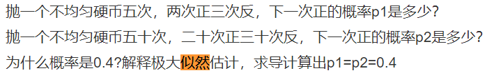

极大似然估计，通俗理解来说，**就是利用已知的样本结果信息，反推最具有可能（最大概率）导致这些样本结果出现的模型参数值！**

**换句话说，极大似然估计提供了一种给定观察数据来评估模型参数的方法，即：“模型已定，参数未知”。**

最大似然估计提供了一种给定观察数据来评估模型参数的方法，即：“模型已定，参数未知”。简单而言，假设我们要统计全国人口的身高，首先假设这个身高服从服从正态分布，但是该分布的均值与方差未知。我们没有人力与物力去统计全国每个人的身高，但是可以通过采样，获取部分人的身高，然后通过最大似然估计来获取上述假设中的正态分布的均值与方差。

 **极大似然估计中采样需满足一个重要的假设，就是所有的采样都是独立同分布的。**

对于这个函数：  输入有两个：x表示某一个具体的数据；  表示模型的参数

如果  是已知确定的，  是变量，这个函数叫做概率函数(probability function)，它描述对于不同的样本点  ，其出现概率是多少。

如果  是已知确定的，  是变量，这个函数叫做似然函数(likelihood function), 它描述对于不同的模型参数，出现 这个样本点的概率是多少。

最大似然估计的求解步骤：

- 确定似然函数
- 将似然函数转换为对数似然函数
- 求对数似然函数的最大值（求导，解似然方程）

#### 2、贝叶斯估计、极大似然估计、最大后验估计原理

<https://www.nowcoder.com/discuss/205864>

**最大似然估计：**是求参数θ, 使似然函数 ![[公式]](https://www.zhihu.com/equation?tex=P%28x_%7B0%7D%7C%5Ctheta%29) 最大。

内容如第一题所示

**最大后验概率估计：**是想求θ使 ![[公式]](https://www.zhihu.com/equation?tex=P%28x_%7B0%7D%7C%5Ctheta%29P%28%5Ctheta%29) 最大。求得的θ不单单让似然函数大，θ自己出现的先验概率也得大。 

MAP其实是在最大化 ![[公式]](https://www.zhihu.com/equation?tex=P%28%5Ctheta%7Cx_%7B0%7D%29%3D%5Cfrac%7BP%28x_%7B0%7D%7C%5Ctheta%29P%28%5Ctheta%29%7D%7BP%28x_%7B0%7D%29%7D)，不过因为![[公式]](https://www.zhihu.com/equation?tex=x_%7B0%7D)是确定的（即投出的“反正正正正反正正正反”）， ![[公式]](https://www.zhihu.com/equation?tex=P%28x_%7B0%7D%29) 是一个已知值，所以去掉了分母![[公式]](https://www.zhihu.com/equation?tex=P%28x_%7B0%7D%29)（假设“投10次硬币”是一次实验，实验做了1000次，“反正正正正反正正正反”出现了n次，则![[公式]](https://www.zhihu.com/equation?tex=P%28x_%7B0%7D%29%3D%5Cfrac%7Bn%7D%7B1000%7D)。总之，这是一个可以由数据集得到的值）。最大化 ![[公式]](https://www.zhihu.com/equation?tex=P%28%5Ctheta%7Cx_%7B0%7D%29) 的意义也很明确，![[公式]](https://www.zhihu.com/equation?tex=x_%7B0%7D)已经出现了，要求θ取什么值使![[公式]](https://www.zhihu.com/equation?tex=P%28%5Ctheta%7Cx_%7B0%7D%29)最大。顺带一提，![[公式]](https://www.zhihu.com/equation?tex=P%28%5Ctheta%7Cx_%7B0%7D%29)即后验概率，这就是“最大后验概率估计”名字的由来。

<https://zhuanlan.zhihu.com/p/48071601>这个讲的还不错

MLE和MAP的区别应该是很清楚的了。**MAP就是多一个作为因子的先验概率P(θ)**。或者，也可以反过来，认为MLE是把先验概率P(θ)认为等于1，即认为θ是均匀分布。

最大后验概率估计的求解步骤：

- 确定参数的先验分布以及似然函数
- 确定参数的后验分布函数
- 将后验分布函数转换为对数函数
- 求对数函数的最大值（求导，解方程）

**贝叶斯估计：**

**贝叶斯估计同样假定是一个随机变量，但贝叶斯估计并不是直接估计出的某个特定值，而是估计的分布**，这是贝叶斯估计与最大后验概率估计不同的地方。在贝叶斯估计中，先验分布)是不可忽略的。

贝叶斯估计要解决的不是如何估计参数，而是用来估计新测量数据出现的概率。

贝叶斯估计的求解步骤：

- 确定参数的似然函数
- 确定参数的先验分布，应是后验分布的共轭先验
- 确定参数的后验分布函数
- 根据贝叶斯公式求解参数的后验分布

#### 3、后验概率计算 极大似然估计手推（一个掷硬币问题，求正面概率）

题目：<https://www.nowcoder.com/discuss/185161>

先验概率：直观理解，所谓“先”，就是在事情之前，即在事情发生之前事情发生的概率。是根据以往经验和分析得到的概率。

后验概率：事情已经发生了，事情发生可能有很多原因，判断事情发生时由哪个原因引起的概率。

对应的题目练习：<https://www.cnblogs.com/lliuye/p/9139032.html>

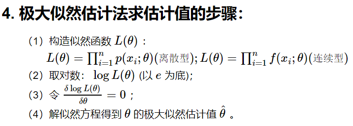

其中：f为概率密度函数（连续）；p为概率函数（离散）

#### 4、给定一个区间a到b的均匀分布，求他的极大似然估计

<https://www.nowcoder.com/discuss/195114>

首先普及一下概率函数P(x)、概率分布函数F(x)、概率密度函数f(x)

**离散随机变量单值有概率，连续随机变量单值无概率**

==**对于离散型变量而言，可以用概率函数P(x)描述所有取值x的对应概率；**==

**概率分布**：给出了所有取值及其对应的概率（少一个也不行），可见只对**==离散==**型变量有意义


**概率函数**：用函数形式给出每个取值发生的概率，P(x)（x=x1，x2，x3，……），只对==**离散**==型变量有意义，实际上是**对概率分布的数学描述**。


注意：**概率分布和概率函数只对离散型变量有意义，那如何描述连续型变量呢？答案就是“概率分布函数”和“概率密度函数”。**

 而对于连续型变量而言，“取某个具体值的概率”的说法是无意义的，只能说“取值落在某个区间内的概率”，或“取值落在某个值领域内的概率”，因此对连续型变量提“概率函数”是不恰当的。连续型随机变量取某些具体值的概率为零

==**概率分布函数和概率密度函数正是用于描述连续型变量的函数**。==

博客描述：<https://www.jianshu.com/p/0cfc3204af77>

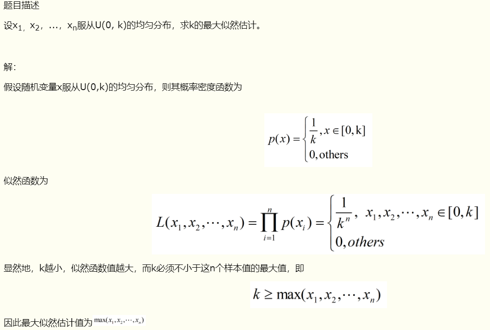


#### 5、极大似然估计和最大后验估计？

<https://www.nowcoder.com/discuss/169304>

MLE和MAP的区别应该是很清楚的了。**MAP就是多一个作为因子的先验概率P(θ)**。或者，也可以反过来，认为MLE是把先验概率P(θ)认为等于1，即认为θ是均匀分布。

#### ==6、 极大似然与交叉熵有什么区别？==

<https://www.nowcoder.com/discuss/188218>

#### 7、为什么极大似然的时候可以相乘？

<https://www.nowcoder.com/discuss/178148>

满足独立同分布

#### 8、最小二乘与极大似然函数的关系？从概率统计的角度处理线性回归并在似然概率为高斯函数的假设下同最小二乘建立了联系

高斯就是正态

<https://www.nowcoder.com/discuss/61907>

答案：<https://zhuanlan.zhihu.com/p/39775467>

我觉得这个回答几乎完美

#### 9、线性模型为何用的最小二乘作为损失函数而不用似然函数或者交叉熵？

<https://www.nowcoder.com/discuss/61907>		

最小二乘法以估计值与观测值的平方和作为损失函数，在误差服从正态分布的前提下，与极大似然估计的思想在本质上是相同。我们通常认为*ε*服从正态分布，通过对极大似然公式的推到，结果真是最小二乘的式子。

回答答案：<https://blog.csdn.net/Beyond_2016/article/details/80030414>

本质与上面的问题相同

mean square loss, binary cross entropy loss, categories cross entropy，其背后的原理都指向了极大似然估计。可见损失函数的定义并不是简单的'衡量预测值与真实值的距离'，其背后有着严谨的数学在为其可靠性做担保。

#### 10、边缘概率、联合概率、条件概率


#### 11、什么是先验概率、后验概率

先验概率：直观理解，所谓“先”，就是在事情之前，即在事情发生之前事情发生的概率。是根据以往经验和分析得到的概率。

后验概率：事情已经发生了，事情发生可能有很多原因，判断事情发生时由哪个原因引起的概率。

### ==概率题==

#### 1、旷视

<https://www.nowcoder.com/discuss/215800>

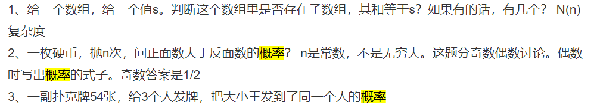

#### 2、字节跳动

<https://www.nowcoder.com/discuss/215883>

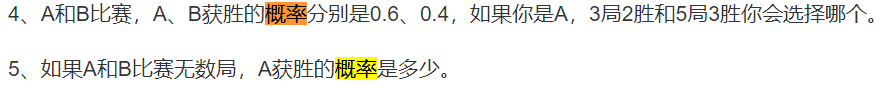

智力：抛硬币，先抛者赢得概率

两个人轮流抛硬币，抛正面就赢，先抛的人获胜的概率


#### 3、作业帮

<https://www.nowcoder.com/discuss/215140>

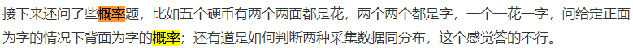

#### 4、头条

<https://www.nowcoder.com/discuss/213671>


#### 5、美团

<https://www.nowcoder.com/discuss/103271>

概率题：抛一个骰子，直到集齐六面，问抛骰子的期望次数。

概率题：randN()转randM()。

概率题：抛色子连续n次正面向上的期望次数。


### ==Python==

#### 1、Python生成器，迭代器，装饰器

<https://www.jianshu.com/p/c77b71a690db>

==生成器：==

```
L = [x + 1 for x in range(10)]
g = (x + 1 for x in range(10))
创建L和g的区别仅在于最外层的[]和()，L是一个list，而g是一个generator。
我们可以直接打印出list的每一个元素，但我们怎么打印出generator的每一个元素呢？
如果要一个一个打印出来，可以通过next()函数（or __next__()）获得generator的下一个返回值：
上面这种不断调用next(g)实在是太变态了，正确的方法是使用for循环，因为generator也是可迭代对象。
g = (x * x for x in range(10))
for n in g:
    print(n,end=";")

```

***生成器对象是通过使用yield关键字定义的函数对象***，因此，生成器也是一个函数。生成器用于生成一个值得序列，以便在迭代器中使用。

请注意：

带yield的函数是一个生成器，这个生成器有一个函数就是next函数，next就相当于“下一步”生成哪个数，**这一次的next开始的地方是接着上一次的next停止的地方执行的，所以调用next的时候，生成器并不会从foo函数的开始执行，只是接着上一步停止的地方开始，然后遇到yield后，return出要生成的数，此步就结束。**


==迭代器==：

可以直接作用于for循环的数据类型有以下几种：

- 一类是集合数据类型,如list,tuple,dict,set,str等
- 一类是generator ，包括生成器和带yeild的generator function


这些可以 直接作用于for循环的对象统称为可迭代对象：Iterable

可以被next()函数调用并不断返回下一个值的对象称为迭代器：Iterator

**list，dict，str虽然是Iterable，却不是Iterator**

**生成器就是一个迭代器**


iter()函数 创建迭代器

iter（iterable）#一个参数，要求参数为可迭代的类型

**把list、dict、str等Iterable变成Iterator可以使用iter()函数**

***你可能会问，为什么list、dict、str等数据类型不是Iterator？***

这是因为Python的Iterator对象表示的是一个数据流，Iterator对象可以被next()函数调用并不断返回下一个数据，直到没有数据时抛出StopIteration错误。可以把这个数据流看做是一个有序序列，但我们却不能提前知道序列的长度，只能不断通过next()函数实现按需计算下一个数据，所以Iterator的计算是惰性的，只有在需要返回下一个数据时它才会计算。

Iterator甚至可以表示一个无限大的数据流，例如全体自然数。而使用list是永远不可能存储全体自然数的。

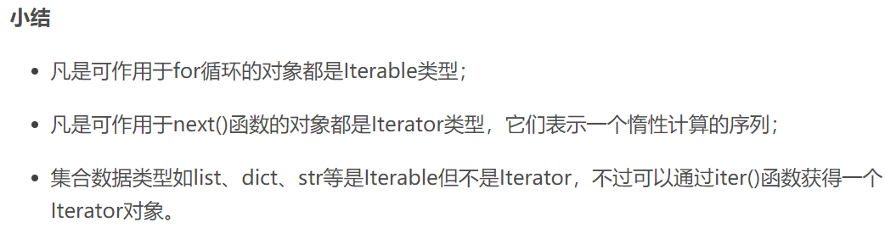

内置迭代工具：

itertools：count无限迭代器；cycle 无限迭代器；


==装饰器：==

*装饰器：本质是函数（装饰其他函数）就是为其他函数添加附加功能*

*高阶函数+嵌套函数 = 装饰器*

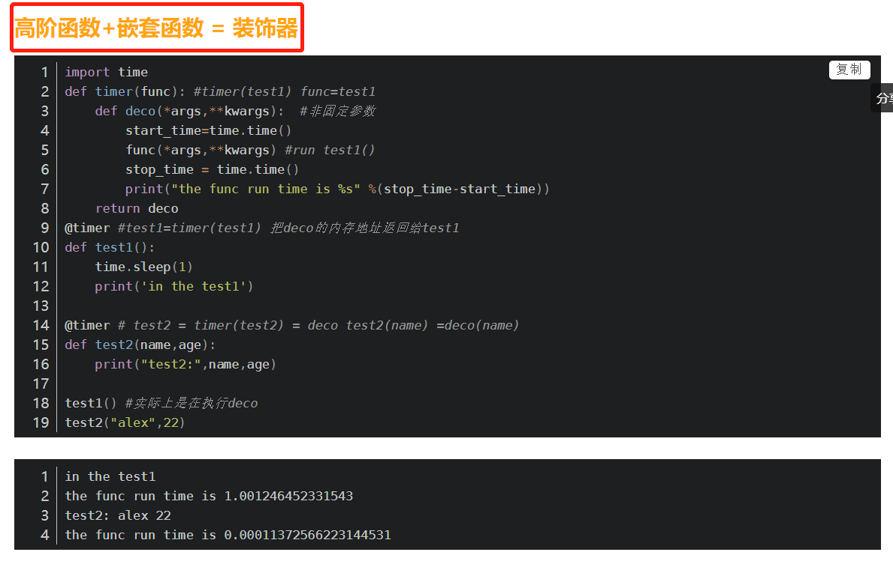


没错，装饰器不仅可以是函数，还可以是类，相比函数装饰器，类装饰器具有灵活度大、高内聚、封装性等优点。**使用类装饰器主要依靠类的call方法**


#### 2、Python多线程与多进程、协程

进程: 是对各种资源管理的集合，qq 要以一个整体的形式暴露给操作系统管理，里面包含对各种资源的调用，内存的管理，网络接口的调用等

线程: 是操作系统最小的调度单位， 是一串指令的集合。

进程要想操作CPU，就必须要创建一个线程（进程中至少包含一个线程）

**区别：**

1.线程共享内存空间（共享数据等），进程的内存空间是独立的

2.同一进程的线程之间可以相互交流 ，2个进程之间的交流必须通过一个中间代理

3.线程可以操作和控制其他线程（同一进程下），进程只能操作和控制子进程。

协程：

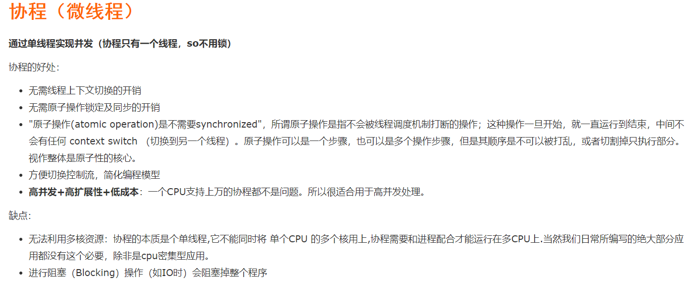

**==python中：==**

==多线程：==

在非python环境中，单核情况下，同时只能有一个任务执行。多核时可以支持多个线程同时执行。但是**在python中，无论有多少核，同时只能执行一个线程。究其原因，这就是由于*GIL*的存在导致的。**

GIL的全称是Global Interpreter Lock(全局解释器锁)，来源是python设计之初的考虑，为了数据安全所做的决定。**某个线程想要执行，必须先拿到GIL，我们可以把GIL看作是“通行证”，并且在一个python进程中，GIL只有一个。拿不到通行证的线程，就不允许进入CPU执行。**GIL只在cpython中才有，因为cpython调用的是c语言的原生线程，所以他不能直接操作cpu，只能利用GIL保证同一时间只能有一个线程拿到数据。而在pypy和jpython中是没有GIL的。

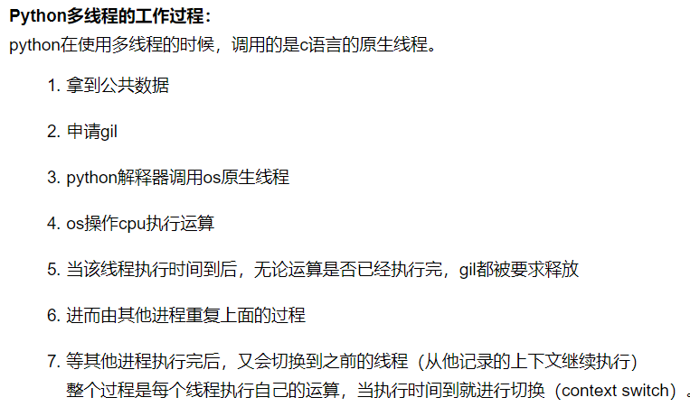

==多进程：==

<https://www.cnblogs.com/whatisfantasy/p/6440585.html>

*通信：*

```
from multiprocessing import Process, Queue
```

多进程之间的通信通过Queue()或Pipe()来实现

*进程池：*

```
from  multiprocessing import Process,Pool
```

由于进程启动的开销比较大，使用多进程的时候会导致大量内存空间被消耗。为了防止这种情况发生可以使用进程池，

#### 3、Python垃圾回收机制

python有自动垃圾回收机制

**python**采用的是以**引用计数机制**为主**,标记清除**和**分代回收**为辅的策略

*引用计数机制:*

优点:1.简单  2.实时性:一旦没有引用,内存就直接释放了,处理回收内存时间分摊到了平时

缺点:1.维护引用计数消耗资源 

​         2.循环引用,就是两个对象你指向我,我指向你,但是没有被外界引用

标记清除：

```
import gc
del c1
gc.collect()
```


#### 4、python 深拷贝，浅拷贝，copy机制

**数字和字符串**

数字和字符串中的内存都指向同一个地址，所以深拷贝和浅拷贝对于他们而言都是无意义的

在浅拷贝中 当改变拷贝对象的值 被拷贝对象的值也会随之改变。

当不想改变被拷贝的值时 应该使用深拷贝。


**浅拷贝**拷贝出来的a对象是引用x和y，当修改x或y的值时，a也会改变；
**深拷贝**会把里面的元素也重新拷贝一份，拷贝了一份x和y的值相等的两个元素，修改x和y的值，不会对b产生影响。

浅拷贝包括：

- 对列表切片拷贝`L[:]`
- 调用对象的拷贝方法：`list.copy()`
- 调用`copy.copy()`

深拷贝包括：

- 调用`copy.deepcopy()`

*注意：*

*在Python中，对象按照可变不可变分为可变对象和不可变对象：*
可变对象 指 可以在原处修改，而不用创建新的对象(包括列表，字典，集合)；
不可变对象指 不支持在原处修改，只能通过表达式创建新的对象，然后把结果分配给变量(包括 数字，字符串，元组)。


#### 5、python的循环引用


#### 6、python，单引号，双引号，三引号区别

1、单引号和双引号都可以用来表示一个字符串

2、单引号和双引号可能在转义字符的情况的情况下有区别

3、**三引号：可以显示多行**；三引号 多行注释


#### 7、如果越界，很大的数的幂次，怎么解决。（怎么解决，python是怎么做的啊）？

https://www.nowcoder.com/discuss/220959?type=post&order=time&pos=&page=1


#### 8、Python里面的lambda表达式写一下，随便写一个

https://www.nowcoder.com/discuss/222018?type=post&order=time&pos=&page=1

lambda表达式，通常是在**需要一个函数，但是又不想费神去命名一个函数**的场合下使用，也就是指**匿名函数**。

```
add = lambda x, y : x+y
add(1,2)  # 结果为3

a = [(1, 2), (4, 1), (9, 10), (13, -3)]
a.sort(key=lambda x: x[1])
print(a)
# Output: [(13, -3), (4, 1), (1, 2), (9, 10)]
```


#### 9、python里list和tuple区别

<https://www.nowcoder.com/discuss/227716?type=post&order=time&pos=&page=1>

1、tuple是一种有序列表，它和list非常相似，但是（但是前面的话也不都是废话）

​      tuple一旦初始化就不能修改，而且没有append() insert()这些方法，可以获取元素但不能赋值变成另外的元素

2、tuple 用( )；list用[ ]

#### 10、python列表怎么去重

https://www.nowcoder.com/discuss/224604?type=post&order=time&pos=&page=1

set是数学意义是无重复元素的无序集合，可以作交、并集等操作


#### 11、 Python字典采用的是什么数据结构？

https://www.nowcoder.com/discuss/122246?type=post&order=time&pos=&page=1

**使用的是key-value匹配的哈希结构**


#### 12、Python 交互式编译怎么实现的？如何看linux下进程占用的内存，python里面如何查看一个字典所占用的内存？简单说一下Python的优势？Python同步和异步的区别？

<https://www.nowcoder.com/discuss/226134?type=post&order=time&pos=&page=1>


#### 13、python中is和==的区别；python方法解析顺序；python中dict和list的区别,dict的内部实现；python dict按照value进行排序；


### ==Git==

1、gitlab一般有哪些权限？

private 

public

group

2、git合并，发生冲突之后怎么处理？

3、Git相关，工作区和暂存区？git push？merge和rebase的区别？

4、git pull和fetch区别？

5、git的使用，怎么避免代码冲突，怎么回退代码，问我有多少种回退机制？

6、git   push和commit的区别

7、说说git里的revert，reset

8、git 指令 切分支，创建分支，创建并切换分支

9、git的工作流？

10、git与svn的区别？讲讲对git的理解？


```
git commit  提交
git branch iss53 ；   git checkout iss53
git checkout -b iss53 分支测试
```

**git merge**

 `git merge`。在 Git 中合并两个分支时会产生一个特殊的提交记录，它有两个父节点。翻译成自然语言相当于：“我要把这两个父节点本身及它们所有的祖先都包含进来。”

```
git branch bugFix; git checkout bugFix; git commit; git checkout master; git commit; git merge bugFix  merge测试
```

**Git Rebase**

第二种合并分支的方法是 `git rebase`。**Rebase 实际上就是取出一系列的提交记录**，“复制”它们，然后在另外一个地方逐个的放下去。

Rebase 的优势就是可以创造更线性的提交历史，这听上去有些难以理解。如果只允许使用 Rebase 的话，代码库的提交历史将会变得异常清晰。

**git head**


**相对引用**

```
^ 指定向上移动一步
~ 指定向上好几步 git checkout HEAD~4
git branch -f master HEAD~3 将 master 分支强制指向 HEAD 的第 3 级父提交。

```

**撤销变更**

```
git reset 通过把分支记录回退几个提交记录来实现撤销改动。你可以将这想象成“改写历史”。git reset 向上移动分支，原来指向的提交记录就跟从来没有提交过一样。git reset HEAD~1
Git Revert 虽然在你的本地分支中使用 git reset 很方便，但是这种“改写历史”的方法对大家一起使用的远程分支是无效的哦！为了撤销更改并分享给别人，我们需要使用 git revert。git revert HEAD
```

**Git Cherry-pick**

```
git cherry-pick C2 C4

```

**交互式的 rebase**

```
git rebase 	-i HEAD~4
```

**本地栈式提交**

```
最后就差把 bugFix 分支里的工作合并回 master 分支了。你可以选择通过 fast-forward 快速合并到 master 分支上，但这样的话 master 分支就会包含我这些调试语句了。你肯定不想这样，应该还有更好的方式……
```

**Git Tags**

```
git tag v1 c1
```

**Git Describe**

```

```


### ==Linux==

#### 1、linux常用指令  会不会awk 全文替换 统计

```
cat /proc/version 显示内核的版本
reboot 重启
shutdown -h now 关闭系统
```

**文件搜索**

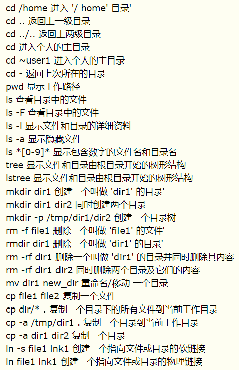

```
cd - 返回上次所在的目录 
pwd 显示工作路径 
tree 显示文件和目录由根目录开始的树形结构
mkdir dir1 创建一个叫做 'dir1' 的目录' 
rmdir dir1 删除一个叫做 'dir1' 的目录' 
rm -rf dir1 删除一个叫做 'dir1' 的目录并同时删除其内容 
mv dir1 new_dir 重命名/移动 一个目录 
ln -s file1 lnk1 创建一个指向文件或目录的软链接 
ln file1 lnk1 创建一个指向文件或目录的物理链接 
```

**文件搜索**

```
find / -name file1 从 '/' 开始进入根文件系统搜索文件和目录 
比如：find ./JD -name \*paper* 
     find ./JD -name \paper*
     find ./JD -name \*.zip
     find ./JD -name \paper* |wc -l   其中wc -l是统计个数
find / -user user1 搜索属于用户 'user1' 的文件和目录 
find /home/user1 -name \*.bin 在目录 '/ home/user1' 中搜索带有'.bin' 结尾的文件 
find /usr/bin -type f -atime +100 搜索在过去100天内未被使用过的执行文件 
find /usr/bin -type f -mtime -10 搜索在10天内被创建或者修改过的文件 
find / -name \*.rpm -exec chmod 755 '{}' \; 搜索以 '.rpm' 结尾的文件并定义其权限 
find / -xdev -name \*.rpm 搜索以 '.rpm' 结尾的文件，忽略光驱、捷盘等可移动设备 
locate \*.ps 寻找以 '.ps' 结尾的文件 - 先运行 'updatedb' 命令 
```

**挂载系统**

```
mount /dev/hda2 /mnt/hda2 挂载一个叫做hda2的盘 - 确定目录 '/ mnt/hda2' 已经存在 
umount /dev/hda2 卸载一个叫做hda2的盘 - 先从挂载点 '/ mnt/hda2' 退出 
```

**磁盘系统**

```
df -h 显示已经挂载的分区列表 
ls -lSr |more 以尺寸大小排列文件和目录 
du -sh dir1 估算目录 'dir1' 已经使用的磁盘空间' 
du -sk * | sort -rn 以容量大小为依据依次显示文件和目录的大小 
```

**ls详解**

```
ls
ls -l 除文件名称外，亦将文件型态、权限、拥有者、文件大小等资讯详细列出
ls -a 显示所有文件及目录,包括隐藏文件
ls -F 在列出的文件名称后加一符号；例如可执行档则加 "*", 目录则加 "/"
ls -l |grep "^-"|wc -l   统计当前文件夹下文件的个数
ls -l |grep "^d"|wc -l   统计当前文件夹下目录的个数
ls -lR|grep "^-"|wc -l   统计当前文件夹下文件的个数，包括子文件夹里的
ls -lR|grep "^d"|wc -l   统计文件夹下目录的个数，包括子文件夹里的
其中：grep "^-" 获取文件；grep "^d"  获取目录； ls -l| grep "^-" 也可以
wc -l 统计输出信息的行数
ls -l | wc -l  也可以输出
ls -lt | head -3   按照时间排序的前三个
ls -l | tail -3   按照名字排序的后三个

```

#### 2、Linux文件指令

linux中最为常用的三大文本（awk，sed，grep）

awk：

```
用于文本处理的语言（取行，过滤），支持正则
NR代表行数，$n取某一列，$NF最后一列
NR==20,NR==30 从20行到30行
FS竖着切，列的分隔符
RS横着切，行的分隔符
```

Sed是Strem Editor(流编辑器)缩写，是操作、过滤和转换文本内容的强大工具。常用功能有增删改查，过滤，取行。

grep：

```
搜索文本，过滤文本字符串
```


#### 3、如何过滤文本中的某些字段。

**grep操作**

<https://www.cnblogs.com/ay-a/p/8206832.html>

```
grep -l return *.*  从所有文件里找到有return的文件
grep  return *.*    从所有文件里找到有return的语句
```

#### 4、查看进程，删除进程

```
ps 命令用于查看当前正在运行的进程
ps -A 查看所有进程
ps -aux 显示所有状态的进程
ps -aux | grep python 找到python进程
kill -9 xxx

```

#### 5、linux用什么命令看负载？我看一个某一个端口是否被占用用什么命令？linux什么命令建立分级目录？

```
uptime 查看机器负载
vmstat 查看cpu负载
netstat -nultp 该命令是查看当前所有已经使用的端口情况
netstat  -anp  |grep  5353 查看某一端口号
mkdir -p Project/{a,b,c,d}/src  建立多级目录
```

#### 6、如何用Linux命令删除文件夹的里的文件，递归删除

rm -rf xxx


#### 7、如何查内存？进程信息？

```
查看内存：1、free 2、top命令用于打印系统的CPU和内存使用情况 3、htop
```

#### 8、chmod 权限

```
chmod ugo+rwx directory1 设置目录的所有人(u)、群组(g)以及其他人(o)以读（r）、写(w)和执行(x)的权限 
chmod go-rwx directory1 删除群组(g)与其他人(o)对目录的读写执行权限 
chown user1 file1 改变一个文件的所有人属性 
chown -R user1 directory1 改变一个目录的所有人属性并同时改变改目录下所有文件的属性 
chgrp group1 file1 改变文件的群组 
chown user1:group1 file1 改变一个文件的所有人和群组属性 
```

#### 9、**Linux下运行的python程序是进程还是线程？Linux下的中断？Linux下的管道？**

多进程

#### 10、Linux用户、用户组	

```
groupadd group_name 创建一个新用户组 
groupdel group_name 删除一个用户组 
groupmod -n new_group_name old_group_name 重命名一个用户组
useradd user1 创建一个新用户 
userdel -r user1 删除一个用户 ( '-r' 排除主目录) 
```


#### 11、Linux相关命令：top、free、sed、grep、cut、netstat、ps

```
top top命令是Linux下常用的性能分析工具，能够实时显示系统中各个进程的资源占用状况
free 命令显示系统内存的使用情况，包括物理内存、交换内存(swap)和内核缓冲区内存
sed sed是一种流编编器，它是文本处理中非常中的工具，能够完美的配合正则表达式便用
grep 作为linux中最为常用的三大文本（awk，sed，grep）处理工具之一，掌握好其用法是很有必要的。
cut 文件内容查看；显示行中的指定部分，删除文件中指定字段；显示文件的内容，类似于下的type命令。
netstat 用于显示与IP、TCP、UDP和ICMP协议相关的统计数据，一般用于检验本机各端口的网络连接情况。
ps 最基本进程查看命令
```

#### 12、Linux的内存管理


### 语义分割评价标准

答案：<https://blog.csdn.net/lingzhou33/article/details/87901365>

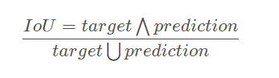

```
intersection = np.logical_and(target, prediction) 
union = np.logical_or(target, prediction) 
iou_score = np.sum(intersection) / np.sum(union)
```

*IoU一般都是基于类进行计算的*，也有基于图片计算的。
*基于类进行计算的IoU就是将每一类的IoU计算之后累加，再进行平均，得到的就是基于全局的评价*，所以我们求的IoU其实是取了均值的IoU，也就是均交并比（mean IoU）


### 行人重识别评价标准

*rank-k：*算法返回的排序列表中，前k位为存在检索目标则称为rank-k命中。eg：rank1：首位为检索目标则rank-1命中。
Cumulative Match Characteristic (*CMC*) curve:计算rank-k的击中率，形成rank-acc的曲线。

*mAP*(mean average precision)：反应检索的人在数据库中所有正确的图片排在排序列表前面的程度，能更加全面的衡量ReID算法的性能。如下图，**该检索行人在gallery中有4张图片，在检索的list中位置分别为1、2、5、7，则ap为(1 / 1 + 2 / 2 + 3 / 5 + 4 / 7) / 4 =0.793；ap较大时，该行人的检索结果都相对靠前，对所有query的ap取平均值得到mAP。**


### 检测评价标准

这个网址很不错：<https://www.jianshu.com/p/d7a06a720a2b>

这里首先介绍几个常见的模型评价术语，现在假设我们的分类目标只有两类，计为正例（positive）和负例（negtive）分别是：

1）True positives(TP):  被正确地划分为正例的个数，即实际为正例且被分类器划分为正例的实例数（样本数）；

2）False positives(FP): 被错误地划分为正例的个数，即实际为负例但被分类器划分为正例的实例数；

3）False negatives(FN):被错误地划分为负例的个数，即实际为正例但被分类器划分为负例的实例数；

4）True negatives(TN): 被正确地划分为负例的个数，即实际为负例且被分类器划分为负例的实例数。　

==Precision== 

其实就是在识别出来的图片中，True positives所占的比率。也就是本假设中，**所有被识别出来的飞机中，真正的飞机所占的比例。**

***precision=TP/（TP+FP）***

==Recall== 

是测试集中所有正样本样例中，被正确识别为正样本的比例。也就是本假设中，**被正确识别出来的飞机个数与测试集中所有真实飞机的个数的比值。**

  ***Recall=TP/(TP+FN)=TP/P***

*如果一个分类器的性能比较好，那么它应该有如下的表现：在Recall值增长的同时，Precision的值保持在一个很高的水平。*而性能比较差的分类器可能会损失很多Precision值才能换来Recall值的提高。通常情况下，文章中都会使用Precision-recall曲线，来显示出分类器在Precision与Recall之间的权衡。


==mAP== 

即 Mean Average Precision即平均AP值，是对多个验证集个体求平均AP值，作为 object dection中衡量检测精度的指标。

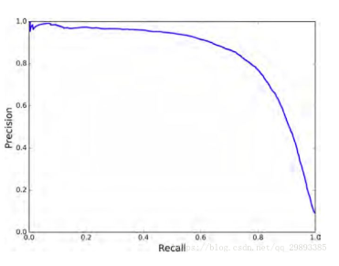

P-R曲线即 以 precision 和 recall 作为 纵、横轴坐标 的二维曲线。通过选取不同阈值时对应的精度和召回率画出

总体趋势，精度越高，召回越低，当召回达到1时，对应概率分数最低的正样本，这个时候正样本数量除以所有大于等于该阈值的样本数量就是最低的精度值。

另外，P-R曲线围起来的面积就是AP值，通常来说一个越好的分类器，AP值越高

最后小小总结一下，在目标检测中，每一类都可以根据 recall 和 precision绘制P-R曲线，AP就是该曲线下的面积，mAP就是所有类AP的平均值。


**==IOU（交并比）==**

IOU 即交并比 即 Intersection-over-Union，是目标检测中使用的一个概念，是一种测量在特定数据集中检测相应物体准确度的一个标准。

IOU表示了产生的候选框（candidate bound）与原标记框（ground truth bound）的交叠率或者说重叠度，也就是它们的交集与并集的比值。相关度越高该值。最理想情况是完全重叠，即比值为1。

**==非极大值抑制（NMS）==**

Non-Maximum Suppression就是需要根据score矩阵和region的坐标信息，从中找到置信度比较高的bounding box。对于有重叠在一起的预测框，只保留得分最高的那个。

*在物体检测中，NMS 应用十分广泛，其目的是为了清除多余的框，找到最佳的物体检测的位置。*

　　最终，检测了bounding box的过程中有两个阈值，一个就是IoU，另一个是在过程之后，从候选的bounding box中剔除score小于阈值的bounding box。需要注意的是：Non-Maximum Suppression**一次处理一个类别**，如果有N个类别，Non-Maximum Suppression就需要执行N次。


(1)从最大概率矩形框F开始，分别判断A~E与F的重叠度IOU是否大于某个设定的阈值;

(2)假设B、D与F的重叠度超过阈值，那么就扔掉B、D；并标记第一个矩形框F，是我们保留下来的。

(3)从剩下的矩形框A、C、E中，选择概率最大的E，然后判断E与A、C的重叠度，重叠度大于一定的阈值，那么就扔掉；并标记E是我们保留下来的第二个矩形框。

就这样一直重复，找到所有被保留下来的矩形框。


```

#coding:utf-8  
import numpy as np  
  
def py_cpu_nms(dets, thresh):  
    """Pure Python NMS baseline."""  
    x1 = dets[:, 0]  
    y1 = dets[:, 1]  
    x2 = dets[:, 2]  
    y2 = dets[:, 3]  
    scores = dets[:, 4]  #bbox打分
  
    areas = (x2 - x1 + 1) * (y2 - y1 + 1)  
	#打分从大到小排列，取index  
    order = scores.argsort()[::-1]  
    #keep为最后保留的边框  
    keep = []  
    while order.size > 0:  
		#order[0]是当前分数最大的窗口，肯定保留  
        i = order[0]  
        keep.append(i)  
		#计算窗口i与其他所有窗口的交叠部分的面积
        xx1 = np.maximum(x1[i], x1[order[1:]])  
        yy1 = np.maximum(y1[i], y1[order[1:]])  
        xx2 = np.minimum(x2[i], x2[order[1:]])  
        yy2 = np.minimum(y2[i], y2[order[1:]])  
  
        w = np.maximum(0.0, xx2 - xx1 + 1)  
        h = np.maximum(0.0, yy2 - yy1 + 1)  
        inter = w * h  
		#交/并得到iou值  
        ovr = inter / (areas[i] + areas[order[1:]] - inter)  
		#inds为所有与窗口i的iou值小于threshold值的窗口的index，其他窗口此次都被窗口i吸收  
        inds = np.where(ovr <= thresh)[0]  
		#order里面只保留与窗口i交叠面积小于threshold的那些窗口，由于ovr长度比order长度少1(不包含i)，所以inds+1对应到保留的窗口
        order = order[inds + 1]  
  
    return keep

```


### 检测模型

#### Faster R-cnn

讲的贼好

<https://www.cnblogs.com/wangyong/p/8513563.html>


#### Mask Rcnn

讲的贼好

<https://www.cnblogs.com/wangyong/p/10614898.html>


#### SSD

